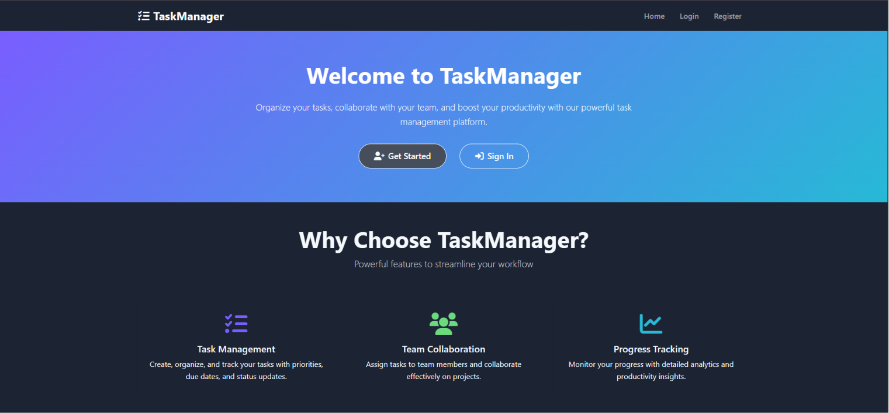
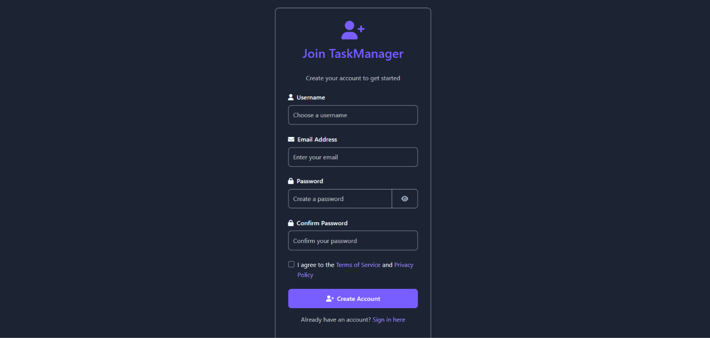
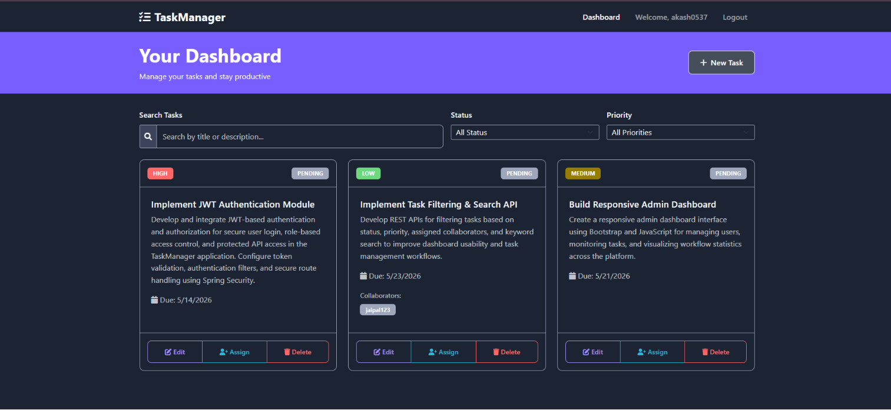
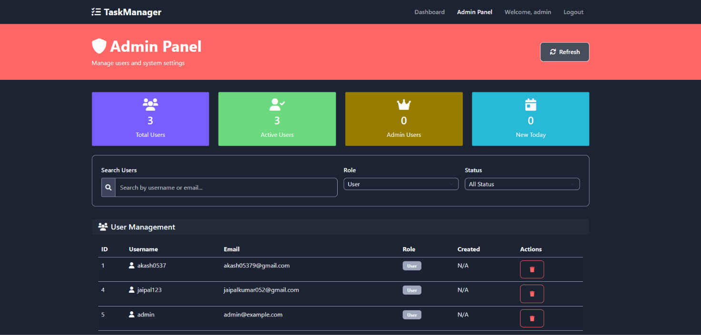

# TaskManager – Full-Stack Task Management System

TaskManager is a full-stack web application built to simplify task tracking and team collaboration. The idea behind this project was to create a clean and practical task management platform where users can organize their work, manage priorities, collaborate with others, and securely access their tasks through authentication and role-based access control.

The application is built using Spring Boot for the backend and a responsive Bootstrap-based frontend, with PostgreSQL used for data storage.

---

# Features

## User Authentication & Security

* User registration and login using JWT authentication
* Secure password handling with Spring Security
* Role-based access control for USER and ADMIN roles

## Task Management

* Create, update, and delete tasks
* Assign priorities and statuses to tasks
* Add collaborators to tasks
* Track personal and collaborative tasks
* Search and filter tasks based on status and priority

## Admin Features

* View all registered users
* Delete tasks and users
* Manage platform activities through admin access

## User Interface

* Responsive dashboard UI
* Clean dark-themed design
* Interactive task management experience
* Separate admin panel for management actions

---

# Tech Stack

## Backend

* Java 17
* Spring Boot
* Spring Security
* Spring Data JPA
* JWT Authentication

## Frontend

* HTML
* CSS
* JavaScript
* Bootstrap 5

## Database

* PostgreSQL

## Build Tool

* Maven

---

# Getting Started

## Prerequisites

Make sure you have the following installed:

* Java 17+
* Maven
* PostgreSQL

---

# Database Setup

Create a PostgreSQL database named:

```sql
CREATE DATABASE task_db;
```

Update your database credentials in:

```text
src/main/resources/application.properties
```

Example:

```properties
spring.datasource.username=postgres
spring.datasource.password=passsword
```

---

# Clone the Repository

```bash
git clone https://github.com/akashkumar-05/Task_Manager.git
cd Task_Manager
```

---

# Run the Project

Build the project:

```bash
mvn clean install
```

Run the application:

```bash
mvn spring-boot:run
```

Open in browser:

```text
http://localhost:8080
```

---

# API Endpoints

## Authentication

* POST `/api/auth/register`
* POST `/api/auth/login`

## Task APIs

* GET `/api/tasks`
* GET `/api/tasks/{id}`
* POST `/api/tasks`
* PUT `/api/tasks/{id}`
* DELETE `/api/tasks/{id}`

## Collaborator APIs

* PUT `/api/tasks/{taskId}/collaborators/{username}`

## Admin APIs

* GET `/api/users`
* DELETE `/api/users/{id}`

---

# Project Structure

```text
Task_Manager/
├── src/main/java/
│   ├── controller/
│   ├── service/
│   ├── repository/
│   ├── model/
│   ├── dto/
│   └── config/
│
├── src/main/resources/
│   ├── static/
│   └── application.properties
│
└── pom.xml
```

---

# What I Learned

Through this project, I gained hands-on experience with:

* Spring Security and JWT authentication
* REST API development
* Role-based authorization
* Database design with PostgreSQL
* Frontend-backend integration
* Task workflow management
* Full-stack application structure

---

# Future Improvements

Some features planned for future versions:

* Email notifications
* File attachments
* Activity logs
* Real-time updates
* Task reminders
* Docker deployment

---

# Screenshots

| Index Page | Register Page |
|------------|---------------|
|  |  |

| User Dashboard | Admin Panel |
|----------------|-------------|
|  |  |

# Author

## Akash Kumar

Java Backend Engineer | Full-Stack Developer

GitHub:
https://github.com/akashkumar-05

LinkedIn:
https://www.linkedin.com/in/akashsight30/
